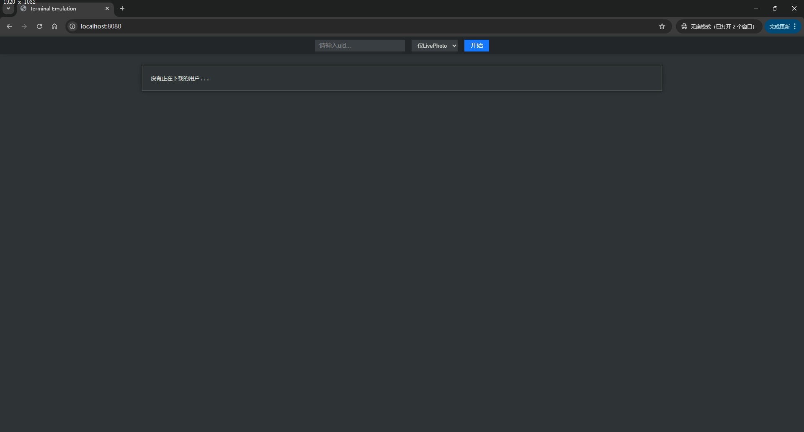

# weibod

## 这是什么

这是一个用 java 语言开发的微博图片下载工具，可以下载指定用户的微博图片。

该工具功能有：

1. 指定用户uid下载图片。
2. 可选下载所有图片和只下载Live Photo。
3. 增量下载，会保存上次下载的最新微博，下次下载时将从上次的微博开始。（如果需要全量下载，请删除cache目录下的文件）

## 如何使用

### 从源代码构建

确保你的构建环境中已安装Java 8，然后在项目目录下执行如下命令构建：


```bash
# For Windows
./gradlew.bat clean build -x test 

#For MacOS/Linux
./gradlew clean build -x test
```

构建成功后，在`build/libs`目录下会生成一个名为`weibod.jar`的jar文件。

### 下载打包后的jar文件
1. 在 [Release](https://github.com/lw900925/weibod/releases) 页面下载最新版本的jar文件。

## 如何运行

1. 在weibod.jar文件所在的目录创建一个config的文件夹，然后在文件夹中创建一个cookie.txt文本文件并将weibo网页端登录后的cookie填写到这个文件中。

2. 请确保你的运行环境中安装了Java 8或更高版本，然后打开终端或命令行工具，执行如下命令：

```bash
java -jar weibod.jar
```

3. 浏览器打开 http://localhost:8080，即可使用。



